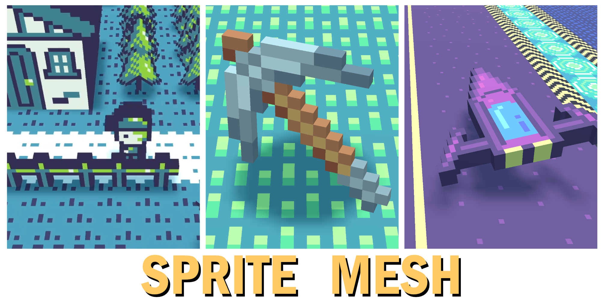
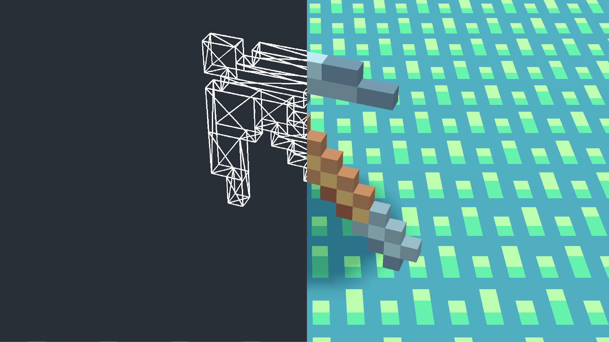
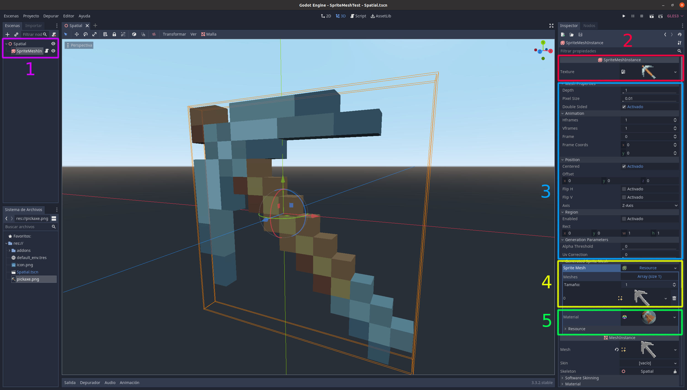
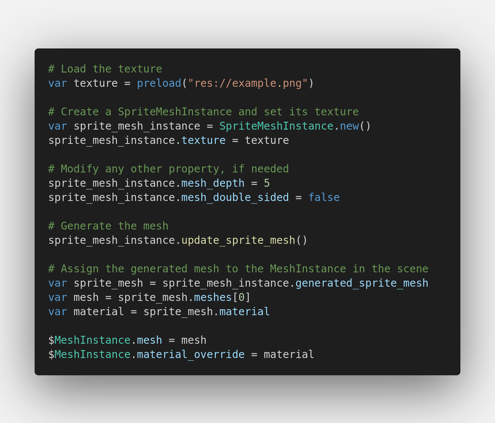

# Sprite Mesh



> **Warning**
> The main branch of this repository now supports Godot 4.x. If you are looking for the Godot 3.x version, please check [this branch](https://github.com/98teg/SpriteMesh/tree/godot-3.x).

## Introduction

SpriteMesh is a plugin for Godot that allows you to create 3D meshes based on a 2D sprite. It adds two new classes, [`SpriteMesh`](#class-spritemesh) and [`SpriteMeshInstance`](#class-spritemeshinstance). [`SpriteMesh`](#class-spritemesh) is a [`Resource`](https://docs.godotengine.org/en/4.0/classes/class_resource.html) that contains an array of meshes and their material. [`SpriteMeshInstance`](#class-spritemeshinstance), which inherit from [`MeshInstance`](https://docs.godotengine.org/en/stable/classes/class_meshinstance.html?highlight=MeshInstance), is used to create the meshes based on the sprite.

[`SpriteMeshInstance`](#class-spritemeshinstance) can also be used to display the generated meshes on the scene. It has the benefit over [`MeshInstance`](https://docs.godotengine.org/en/stable/classes/class_meshinstance.html?highlight=MeshInstance) in that it adds support for animations in which each frame is a different mesh, as seen in the example below.


The algorithm [`SpriteMeshInstance`](#class-spritemeshinstance) uses to generate the meshes is a bit demanding. It is for this reason that I do not recommend executing it frequently. However, it has the benefit that the mesh it produces tends to optimize the number of tris. In this image, you can see the result of this algorithm.



## How to use it

There are two ways of using this plugin, via the editor or code. For both of them, you would need to include the folder `sprite_mesh` of this project into the `addons` directory of your Godot project. Then click the `Project` dropdown, select `Project Settings...` and go to the `Plugins` tab. Lastly, click on the `Active` check box at the SpriteMesh row.

### Using the editor

I recommend this method if you don't need to generate the meshes procedurally. Using the editor, the algorithm would not be executed at runtime.

1. Instantiate a [`SpriteMeshInstance`](#class-spritemeshinstance) in your scene.
2. Assign the texture for your model.
3. Change any of the properties, if needed. When you change a property, you need to wait three seconds for the editor to update the meshes. This behavior is intended, as it provides a better user experience.
4. Save or copy the generated mesh if you want to use it in [`MeshInstance`](https://docs.godotengine.org/en/stable/classes/class_meshinstance.html?highlight=MeshInstance) nodes.
5. Save or copy the generated material if you want to use it in [`MeshInstance`](https://docs.godotengine.org/en/stable/classes/class_meshinstance.html?highlight=MeshInstance) nodes. Remember to make it unique if you reuse this [`SpriteMeshInstance`](#class-spritemeshinstance) to generate other meshes.

If you want to use animations and pretend to use [`SpriteMeshInstance`](#class-spritemeshinstance) nodes in your scene instead, you can save or copy the [`SpriteMesh`](#class-spritemesh) and assign it to other [`SpriteMeshInstance`](#class-spritemeshinstance) nodes. It is more memory efficient than creating another [`SpriteMeshInstance`](#class-spritemeshinstance) and setting the same texture.



### Using code

I recommend this method if you need to generate the meshes procedurally. Bellow is an example of how to create them.



Even if this option is available, I recommend only executing it on methods that are not called frequently, such as `_ready`. If you want to, for example, flip a character sprite, it is better to just rotate the model than changing the [`flip_h`](#bool-flip_h--false) property and regenerating it. The only properties meant to change frequently at runtime are [`frame`](#int-frame--0) and [`frame_coords`](#vector2i-frame_coords--vector2i0-0). And as such, they don't require to call [`update_sprite_mesh`](#void-update_sprite_mesh) to be applied.

## Class `SpriteMesh`

### Description

[`SpriteMesh`](#class-spritemesh) is a [`Resource`](https://docs.godotengine.org/en/4.0/classes/class_resource.html) that contains an array of meshes and their material.

### Properties

|Type|Name|Default value|
|-|-|-|
| `StandardMaterial3D` | [`material`](#standardmaterial3d-material) |  |
| `Array[ArrayMesh]` | [`meshes`](#arrayarraymesh-meshes) | [] |

### Properties Descriptions

#### `StandardMaterial3D material`

The meshes' material.

```gdscript
void set_material(StandardMaterial3D material)

StandardMaterial3D get_material()
```

#### `Array[ArrayMesh] meshes`

Array of meshes. Each mesh of the array represents a frame of the animation.

```gdscript
void set_meshes(Array[ArrayMesh] meshes)

Array[ArrayMesh] get_meshes()
```

## Class `SpriteMeshInstance`

### Description

[`SpriteMeshInstance`](#class-spritemeshinstance), which inherit from [`MeshInstance`](https://docs.godotengine.org/en/stable/classes/class_meshinstance.html?highlight=MeshInstance), is used to create the meshes based on the sprite. It is inspired by [`Sprite3D`](https://docs.godotengine.org/en/4.0/classes/class_sprite3d.html), so many of its properties behave similarly.

### Properties

|Type|Name|Default value|
|-|-|-|
| `float` | [`alpha_threshold`](#float-alpha_threshold--00) | `0.0` |
| `Vector3.Axis` | [`axis`](#vector3axis-axis--2) | `2` |
| `bool` | [`centered`](#bool-centered--true) | `true` |
| `float` | [`depth`](#float-depth--10) | `1.0` |
| `bool` | [`double_sided`](#bool-double_sided--true) | `true` |
| `bool` | [`flip_h`](#bool-flip_h--false) | `false` |
| `bool` | [`flip_v`](#bool-flip_v--false) | `false` |
| `int` | [`frame`](#int-frame--0) | `0` |
| `Vector2i` | [`frame_coords`](#vector2i-frame_coords--vector2i0-0) | `Vector2i(0, 0)` |
| `SpriteMesh` | [`generated_sprite_mesh`](#spritemesh-generated_sprite_mesh) |  |
| `int` | [`hframes`](#int-hframes--1) | `1` |
| `Vector3` | [`offset`](#vector3-offset--vector30-0) | `Vector2(0, 0)` |
| `float` | [`pixel_size`](#float-pixel_size--001) | `0.01` |
| `bool` | [`region_enabled`](#bool-region_enabled--false) | `false` |
| `Rect2` | [`region_rect`](#rect2-region_rect--rect20-0-0-0) | `Rect2(0, 0, 0, 0)` |
| `Texture2D` | [`texture`](#texture2d-texture) |  |
| `float` | [`uv_correction`](#float-uv_correction--00) | `0.0` |
| `int` | [`vframes`](#int-vframes--1) | `1` |

### Methods

|Returned type|Declaration|
|-|-|
|`ArrayMesh`|[`get_mesh_with_index(int index)`](#arraymesh-get_mesh_with_indexint-index)|
|`void`|[`update_sprite_mesh()`](#void-update_sprite_mesh)|

### Properties Descriptions

#### `float alpha_threshold = 0.0`

The maximum value of alpha for the algorithm to not render a given pixel.

```gdscript
void set_alpha_threshold(float value)

float get_alpha_threshold()
```

#### `Vector3.Axis axis = 2`

The direction in which the front of the mesh faces.

```gdscript
void set_axis(Vector3.Axis value)

Vector3.Axis get_axis()
```

#### `bool centered = true`

If `true`, mesh will be centered.

```gdscript
void set_centered(bool value)

bool is_centered()
```

#### `float depth = 1.0`

Depth of the mesh, measured in pixels.

```gdscript
void set_depth(float value)

float get_depth()
```

#### `bool double_sided = true`

If `true`, mesh can be seen from the back as well, if `false`, it is invisible when looking at it from behind.

```gdscript
void set_draw_flag(DrawFlags flag, bool enabled)

bool get_draw_flag(DrawFlags flag)
```

#### `bool flip_h = false`

If `true`, mesh is flipped horizontally.

```gdscript
void set_flip_h(bool value)

bool is_flipped_h()
```

#### `bool flip_v = false`

If `true`, mesh is flipped vertically.

```gdscript
void set_flip_v(bool value)

bool is_flipped_v()
```

#### `int frame = 0`

Current frame to display from sprite sheet. [`hframes`](#int-hframes--1) or [`vframes`](#int-vframes--1) must be greater than `1`.

```gdscript
void set_frame(int value)

int get_frame()
```

#### `Vector2i frame_coords = Vector2i(0, 0)`

Coordinates of the frame to display from sprite sheet. This is as an alias for the frame property. [`hframes`](#int-hframes--1) or [`vframes`](#int-vframes--1) must be greater than 1.

```gdscript
void set_frame_coords(Vector2i value)

Vector2i get_frame_coords()
```

#### `SpriteMesh generated_sprite_mesh`

The result of the algorithm. It would generate automatically in the editor, or after calling [`update_sprite_mesh`](#void-update_sprite_mesh) in code.

```gdscript
void set_generated_sprite_mesh(SpriteMesh value)

SpriteMesh get_generated_sprite_mesh()
```

#### `int hframes = 1`

The number of columns in the sprite sheet.

```gdscript
void set_hframes(int value)

int get_hframes()
```

#### `Vector3 offset = Vector3(0, 0)`

The mesh's placing offset.

```gdscript
void set_offset(Vector3 value)

Vector3 get_offset()
```

#### `float pixel_size = 0.01`

The size of one pixel's width on the sprite to scale it in 3D.

```gdscript
void set_pixel_size(float value)

float get_pixel_size()
```

#### `bool region_enabled = false`

If `true`, the sprite will use [`region_rect`](#rect2-region_rect--rect20-0-0-0) and display only the specified part of its texture.

```gdscript
void set_region_enabled(bool value)

bool is_region_enabled()
```

#### `Rect2 region_rect = Rect2(0, 0, 0, 0)`

The region of the atlas texture to display. [`region_enabled`](#bool-region_enabled--false) must be `true`.

```gdscript
void set_region_rect(Rect2 value)

Rect2 get_region_rect()
```

#### `Texture2D texture`

Texture2D object to draw.

```gdscript
void set_texture (Texture2D value)

Texture2D get_texture()
```

#### `float uv_correction = 0.0`

Sometimes, the UV mapping would leak the color of adjacent pixels into parts of the mesh where they shouldn't be. As a result, some lines of color may appear at the border of some faces.

This property aims to fix this problem. When its value increases, the UV mapping would move inwards. Be careful, as it would also produce misalignment.

```gdscript
void set_uv_correction(float uv_correction)

float get_uv_correction()
```

#### `int vframes = 1`

The number of rows in the sprite sheet.

```gdscript
void set_vframes(int value)

int get_vframes()
```

### Method Descriptions

#### `ArrayMesh get_mesh_with_index(int index)`

Returns the mesh that corresponds to a frame of the animation, represented by its index.

#### `void update_sprite_mesh()`

Generates the meshes and material given the current properties.

## Support

Just give a good ol' star to this GitHub repository if you enjoy this plugin, it means a lot.

## Credits

Sprites for the demo project are from [Ninja Adventure](https://pixel-boy.itch.io/ninja-adventure-asset-pack), made by [Pixel-Boy](https://twitter.com/2Pblog1) and [AAA](https://www.instagram.com/challenger.aaa/?hl=fr), check out their work!
